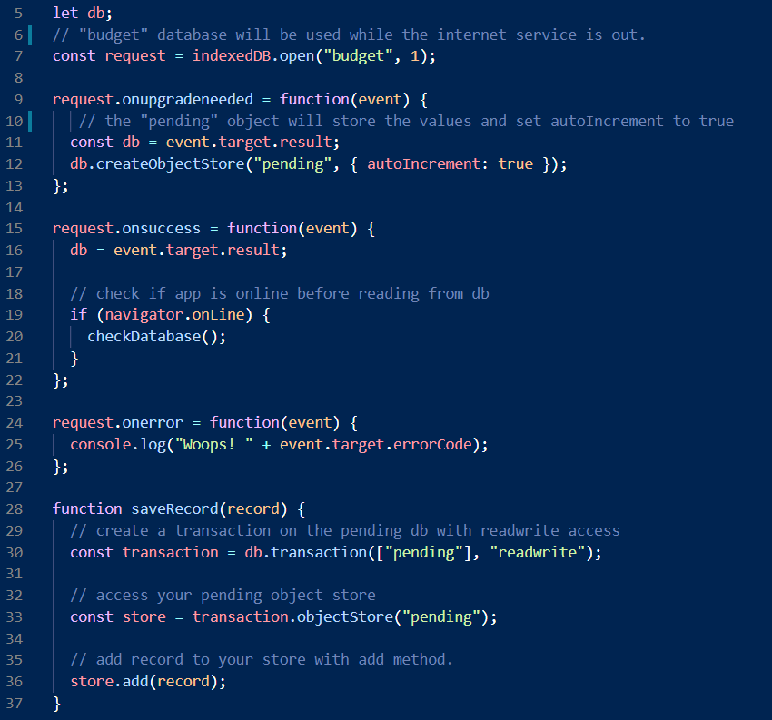

# Progressive-Budget
Tracking budgetary transactions on real time 

#### Link to deployed app
 <https://budget-pr.herokuapp.com>
   
MIT 

## About this application:
`Node.js`, `Mongodb`, `mongoose`, `Express`, `service workers`, `indexDB` application, handling api and html routes, offering an offline experience in case of intermittent internet service.

## Table of contents:
* [Progressive Budget](#Progressive-Budget)
* [About](#about-this-application)
* [Usage](#usage)
* [Installation](#installation)
* [License](#license)
* [Testing](#special-testing-instructions)
* [In case of Questions](#in-case-of-questions)
* [Link to App](#Link-to-deployed-app)

# Usage:
    This  application can be used locally or remotely using `HEROKU`, this app is backed supported by mongodb when it is ran locally, mongodb atlas whe it is served and IndexDB while internet service is not available.

    Right after starting the application (locally thru "node Server.JS) the page is deployed and presented to the user an interface to add and subtract funds.

    All transactions are listed and a `cashflow` chart is displayed to track the movements thru the time. 

- Here it is an example on how this application works:

---
## Installation:
### For Local Deployment: 
The application requires `mongoose`, `Express`, `dotenv` and `morgan` node packages.
a JSON file is provided with these dependencies please Run `npm install`  before executing `node Server.js`

IMPORTANT: Please create a `dontenv` file for your MONGODB_URI and call the link to your Atlas database service connection with your username and password  password.

### For Remote Deployment: 
Please "click" on this link to go to the heroku version of this app:

<https://budget-pr.herokuapp.com>

## License
I have used the MIT license for this application see repository documentation.

<https://opensource.org/licenses/MIT>

## Testing
This can be manually tested or using any test tool

## Code Screenshots:
- Service worker configuration example 
 
- IndexDB Configuration for offline db handling: 

 

## In case of questions:
Please contact me at my e-mail: 
rodolfodzr@gmail.com

Follow me on Github
<https://github.com/Rodolfod1>